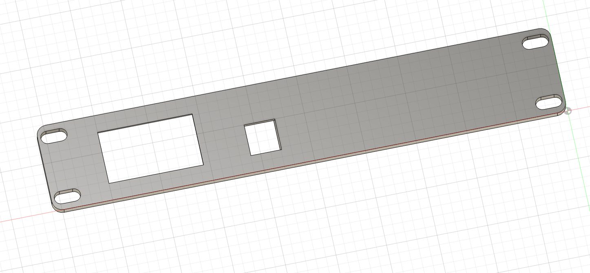
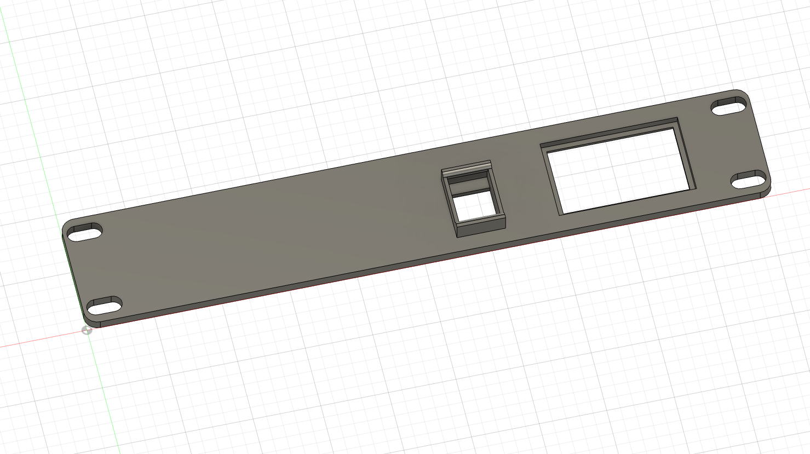
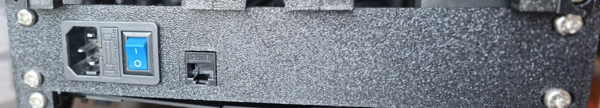
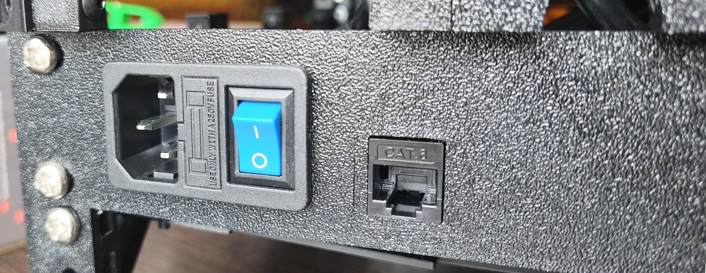
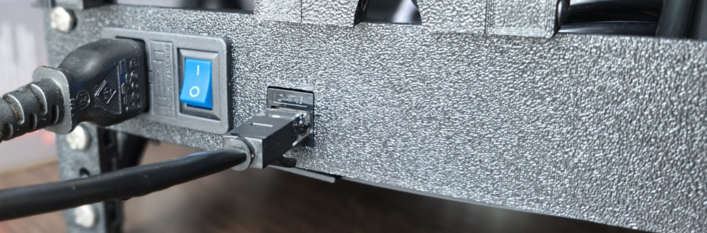

# 10-inch Rack Mount 1U AC Keystone RJ45 Backplate

A compact, 3D-printable 1U rack-mount panel designed specifically for 10-inch server racks. This insert centralizes your
power and connectivity, providing a clean, professional aesthetic for homelab infrastructure

**Key Features:**

- **Power Connectivity:** Integrated mounting for an C14 (AC01) power inlet, allowing you to establish a secure,
  standardized single-point power entry for your rack
- **Network Routing:** Standardized Keystone cutout for RJ45 jacks, serving as a clean patch point for your homelab’s
  network backbone

## Links

- [Model on Maker World](https://makerworld.com/en/models/2858471-10-inch-rack-mount-1u-ac-keystone-rj45-backplate#profileId-3189465)
- [Model on Printables](https://www.printables.com/model/1737504-10-inch-rack-mount-1u-ac-keystone-rj45-backplate)

## Files

- [Bambu Studio .3mf file](mini-rack-backplate.3mf)
- [Fusion .f3d file](mini-rack-backplate.f3d)
- [.step file](mini-rack-backplate.step)

## Preview

### 3D

### Printed

