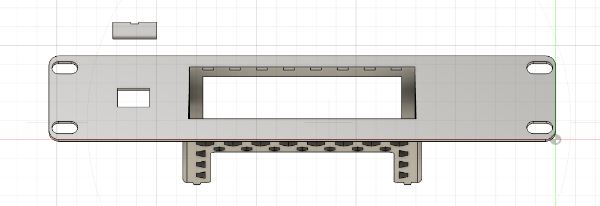
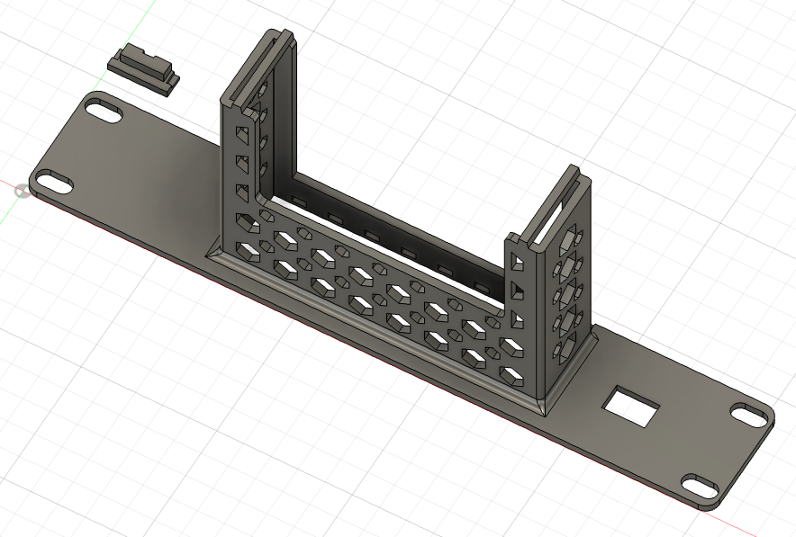
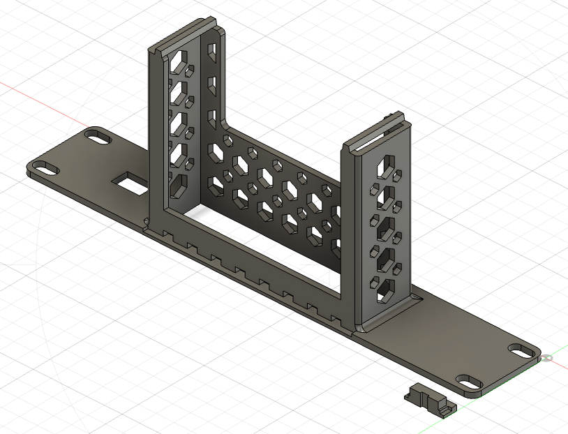

# MikroTik hEX S (RB760iGS) 1U 10-inch Rack Mount

A compact 1U rack mount designed to fit the MikroTik hEX S (RB760iGS) into standard 10-inch mini racks

**Features:**

- **Integrated Power Cable Channel:** Features a built-in routing canal and cable fixator to keep your power line
  secured

## Links

- [Model on Maker World](https://makerworld.com/en/models/2858471-10-inch-rack-mount-1u-ac-keystone-rj45-backplate#profileId-3189465)
- [Model on Printables](https://www.printables.com/model/1737504-10-inch-rack-mount-1u-ac-keystone-rj45-backplate)

## Files

- [Bambu Studio .3mf file](mikrotik-hex-s.3mf)
- [Fusion .f3d file](mikrotik-hex-s.f3d)
- [.step file](mikrotik-hex-s.step)

## Preview

### 3D

