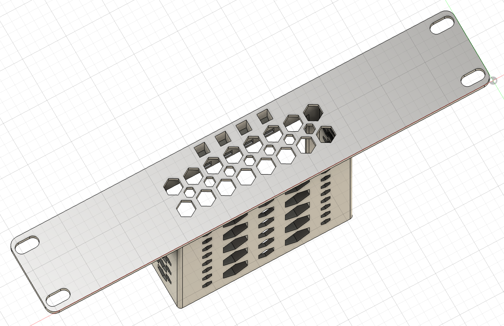
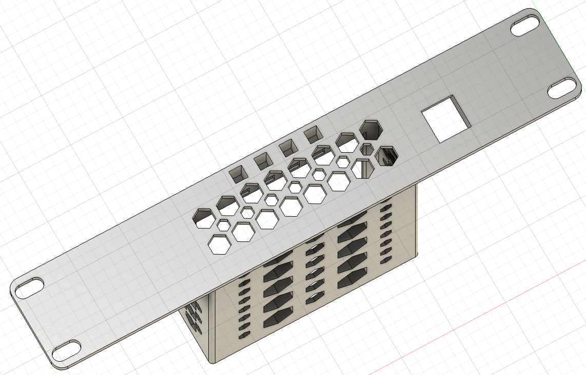
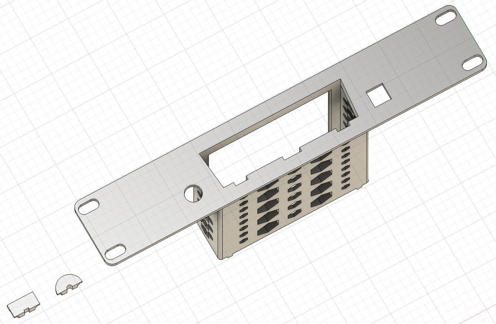
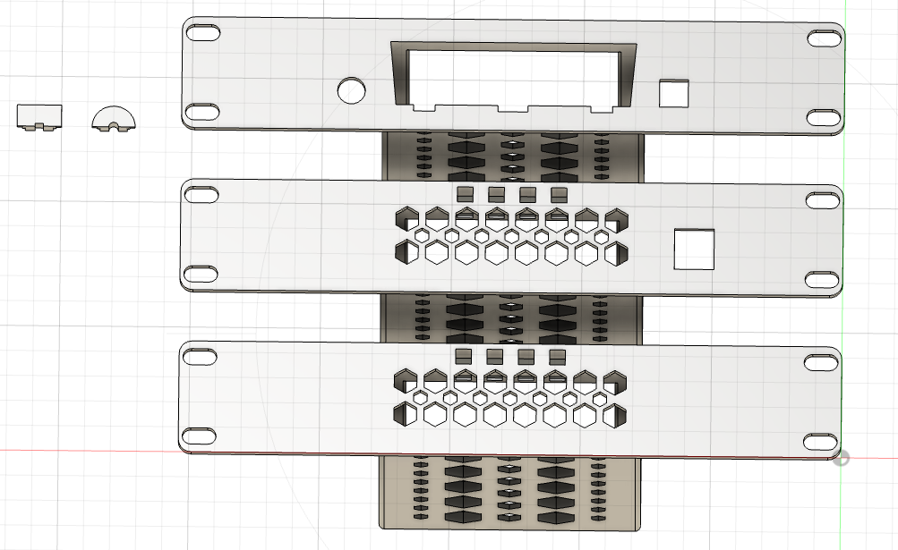
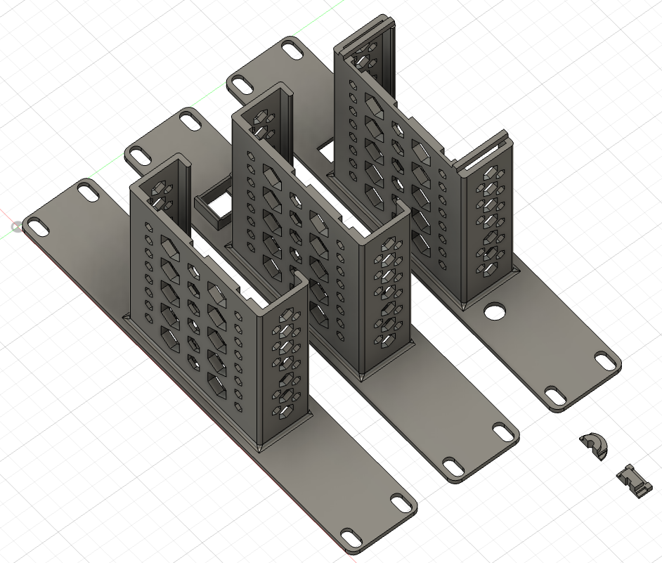
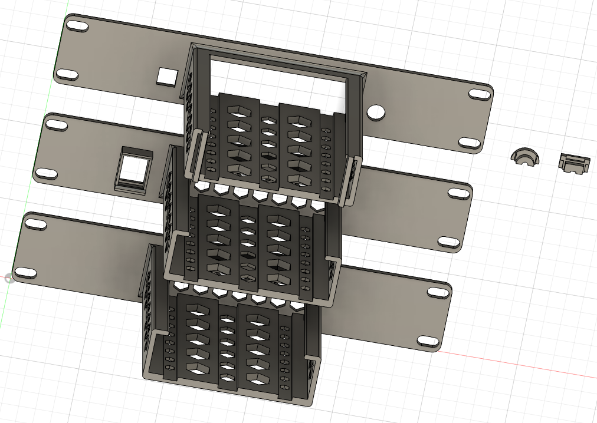

# ONU XPON PL8800Z 1U 10-inch Rack Mount

This model is a 1U 10-inch rack mount designed specifically for the **ONU XPON PL8800Z**

## Links

- [Model on Maker World](TODO)
- [Model on Printables](TODO)

## Variants

To accommodate different installation requirements, this model is available in three distinct configurations:

- **Variant #1: Standard Rear-Facing**
    - Designed for clean, minimalist rack aesthetics by orienting the device ports toward the back. This version
      features integrated precision-molded light channels that pipe the ONU’s front-panel status LEDs to the front of
      the rack, allowing for immediate visual verification of network and power status without the need to access the
      rear of the rack
- **Variant #2: Rear-Facing with Keystone RJ45**
    - Combines the benefits of rear-facing ports with a dedicated Keystone RJ45 cutout for clean patch-panel
      integration. Like Variant A, this model includes integrated light channels to ensure you can monitor device status
      at a glance from the front of the rack, even while using the rear-port configuration
- **Variant #3: Front-Facing Integrated**
    - Optimized for maximum accessibility, this variant keeps device ports facing forward. It includes dedicated cable
      canals and integrated mechanical fixators for both DC power and fiber optic cabling to prevent strain and
      accidental disconnection

## Specs

- **Standard:** 10-inch Rack (Mini Rack)
- **Height:** 1U (1.75 inches / 44.45 mm)
- **Hardware:** Designed for use with standard M6 rack mounting hardware

## Files

- [Bambu Studio .3mf file](onu-rack-mount.3mf)
- [Fusion .f3d file](onu-rack-mount.f3d)
- [.step file](onu-rack-mount.step)

## Preview

### 3D

