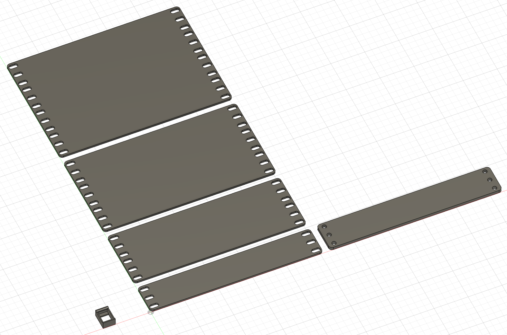
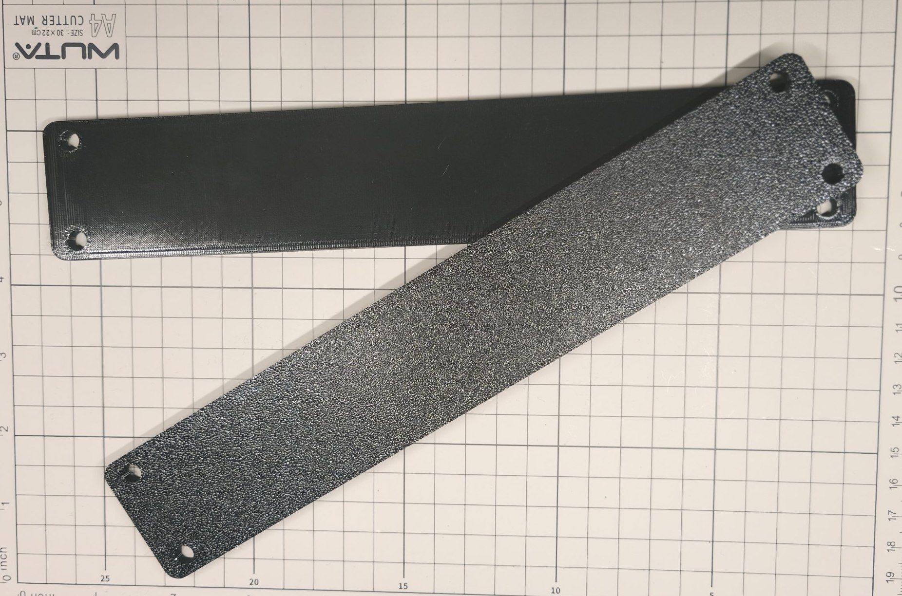

# 10-inch Rack Mount Templates

Collection of design templates for customizing mini-racks. These files provide accurate, standardized dimensions to help
you design custom faceplates, brackets, and networking components without having to measure or prototype from scratch

**Available templates**

- **Panel Templates (1U, 2U, 3U, 4U):** Base dimension layouts for standard rack unit heights
- **1U Alignment Template:** A calibration tool designed to help establish and lock in the correct spacing between your
  vertical rack rails during assembly, ensuring the final enclosure matches standard dimensions
- **Keystone RJ45 Template:** A precise cutout layout for standard RJ45 keystone jacks, useful for integrating network
  ports
  directly into custom panels

## Links

- [Model on Maker World](https://makerworld.com/en/models/2858028-mini-rack-mount-templates#profileId-3188912)
- [Model on Printables](https://www.printables.com/model/1737275-mini-rack-mount-templates)

## Files

- [Bambu Studio .3mf file](rack-mount-templates.3mf)
- [Fusion .f3d file](rack-mount-templates.f3d)
- [.step file](rack-mount-templates.step)

## Preview

### 3D

### Printed

